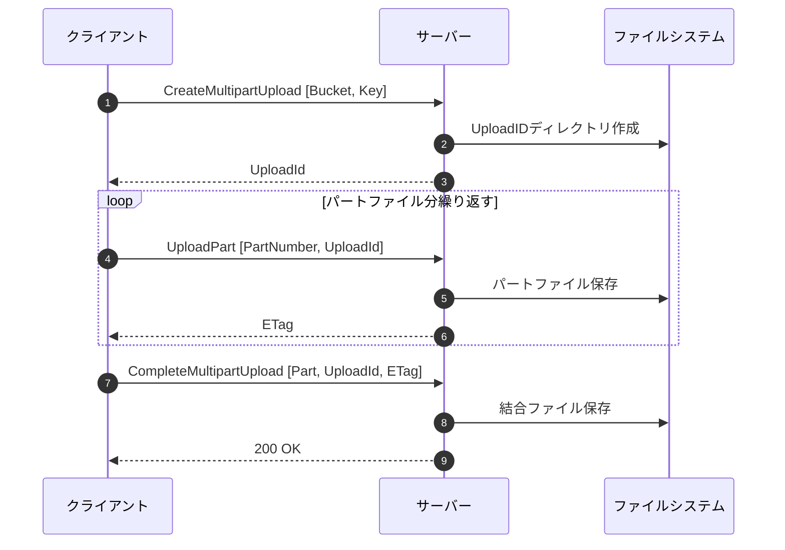
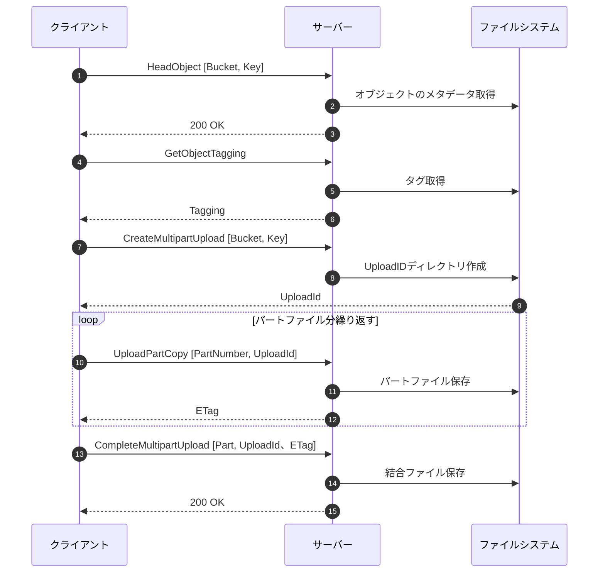

# マルチパートアップロード
## 一時保存構成
パートナンバーファイルを変更、削除ができるように完了するまではデータを保持
1. UploadIDディレクトリを作成
2. ルートパス: `/root/.S3BabyServer/MultiPartUpload/UploadId`
3. 各パートを連番ファイルとして保存（例: `1`, `2`, `3`, ...）
4. 保存が完了したパートの内容を`UploadID1_meta.json`に保存
- `UploadID1_meta.json`の内容例:
```json
{
  "Bucket": "バケット名",
  "Key": "ファイル名",
  "Parts": [
    {"PartNumber": 1, "ETag": "etag1"},
    {"PartNumber": 2, "ETag": "etag2"}
  ]
}
```

## アップロード完了時
CompleteMultipartUploadが複数リクエストされた場合、古いリクエストは無効にし、新しいリクエストを有効とする。
1. CompleteMultipartUploadで指定されたパートを順番に読み込み結合。
2. 結合したファイルを本ファイルとして保存。
3. 本ファイル名_meta.jsonにMultipartETagをキー、バリューを結合後のETagとした記載を追加。
4. `/root/.S3BabyServer/MultiPartUpload/UploadId`を削除。


## ローカル→サーバー
## 概要
大規模ファイルをローカルからサーバーに上げる場合の処理  
*クライアントはファイル容量によって（閾値）マルチパートアップロードへの切り替えを行う*

## API
- CreateMultipartUpload
- UploadPart
- CompleteMultipartUpload

## シーケンス図


## ディレクトリ→ディレクトリ
### 概要
大規模ファイルをサーバー間でコピーする際の処理  
*閾値によってマルチパートアップロードへの切り替えを行う*

### API
- HeadObject
- GetObjectTagging
- CreateMultipartUpload
- UploadPartCopy
- CompleteMultipartUpload


### シーケンス図
